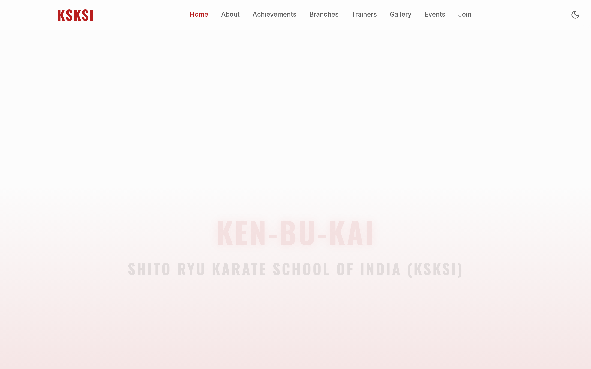
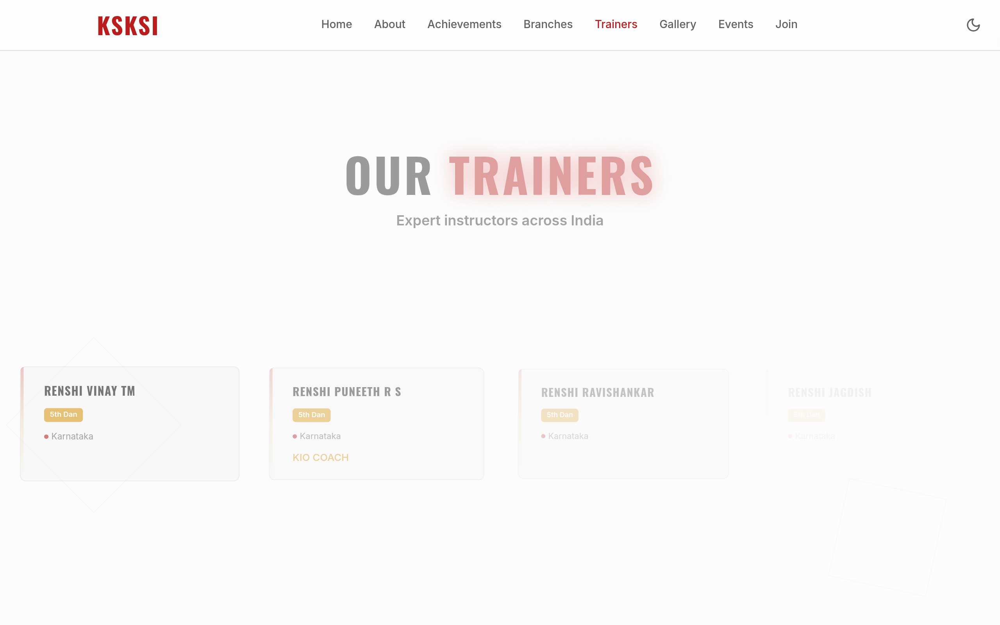

<div align="center">
  <a href="https://ksksikarate1.com">
    
  </a>
  <br />
  <br />

  <h1>Ken-Bu-Kai Shito-Ryu Karate School of India (KSKSI) 🥋</h1>
  
  <p>
    <b>The official digital dojo for a prestigious, real-world martial arts academy.</b><br />
    <a href="https://ksksikarate1.com">Visit the Live Academy Portal</a>
  </p>
</div>

---

## 📜 The Narrative 

**Ken-Bu-Kai Shito-Ryu Karate School of India** is not a conceptual project—it is a breathing, thriving institution founded in 2010 by **Shihan Dr. M. Vijayan** (8th Dan Black Belt) where physical discipline meets mental fortitude.

When tasked with bringing this esteemed academy into the digital age, our mission was clear: *the platform must reflect the precision, strength, and fluidity of the Shito-Ryu fighting style itself.* This repository holds the exact source code running at [ksksikarate1.com](https://ksksikarate1.com). It serves as the primary gateway for prospective students, a central hub for parents, and a showcase of the academy's deep lineage extending back to **Soke Kenyu Mabuni**.

## 📸 Inside the Dojo (Live Captures)

### The Academy & Legacy
The *"About"* portal chronicles the rich history of the academy. It proudly features our **Founder & President, Shihan Dr. M. Vijayan**, alongside our **Secretary, Renshi J M Jerome** (6th Dan). It also demystifies the 60+ Katas of our WKF-recognized Shito-Ryu style.

<kbd>
  
</kbd>

### Our Expert Trainers
The academy's reach spans across states like Karnataka, Andhra Pradesh, Tamil Nadu, and Kerala. The *"Trainers"* section highlights our expansive roster of dedicated Renshis and Senseis who lead the charge.

<kbd>
  
</kbd>

## 🥋 Key Digital Offerings

The website algorithmically organizes the academy's real-world functions:
- **Dojo Registration Matrix**: A robust **Web3Forms** integration for new students submitting trial class requests directly from their phones.
- **Instructors Network**: Sorting and showcasing our National and State-level coaches based on rank.
- **Scroll-Animated Legacy**: Using `framer-motion` to reveal the timeline and values (Discipline, Respect, Excellence, Community) as visitors journey down the page.

## ⚙️ Technical Stance

Behind the sleek dark-themed interface lies a modern, robust React architecture:

- **Frontend Core**: Powered by **[React.js](https://reactjs.org/)** and **[Vite](https://vitejs.dev/)** for immediate rendering and lightning-fast user experience.
- **Styling Architecture**: Designed entirely with **[Tailwind CSS](https://tailwindcss.com/)** to implement a highly responsive, utility-first layout that looks pristine on any device.
- **Interactive UI**: Utilizing **[shadcn-ui](https://ui.shadcn.com/)** and **Framer Motion** for deeply accessible components and martial-arts-inspired micro-animations.
- **Type Safety**: Strictly written in **[TypeScript](https://www.typescriptlang.org/)** to ensure code reliability and minimize runtime errors.

## 🚀 Step Onto the Mat (Local Setup)

Want to run the platform locally or contribute to the academy's digital footprint? Follow these steps:

1. **Clone the repository:**
   ```bash
   git clone https://github.com/lolaamh06/ksksi-karate-website.git
   cd ksksi-karate-website
   ```

2. **Install the training gear (Dependencies):**
   ```bash
   npm install
   ```

3. **Start the sparring match (Development Server):**
   ```bash
   npm run dev
   ```

4. **Bow in:** Open your browser and navigate to `http://localhost:8080`.

## 🚢 Deployment

The dojo is continuously deployed to ensure students and masters always see the latest updates. 
Currently live at: **[ksksikarate1.com](https://ksksikarate1.com)**

---

<div align="center">
  <i>"Karate begins with courtesy and ends with courtesy."</i>
  <br />
  <b>Built with discipline.</b>
</div>
